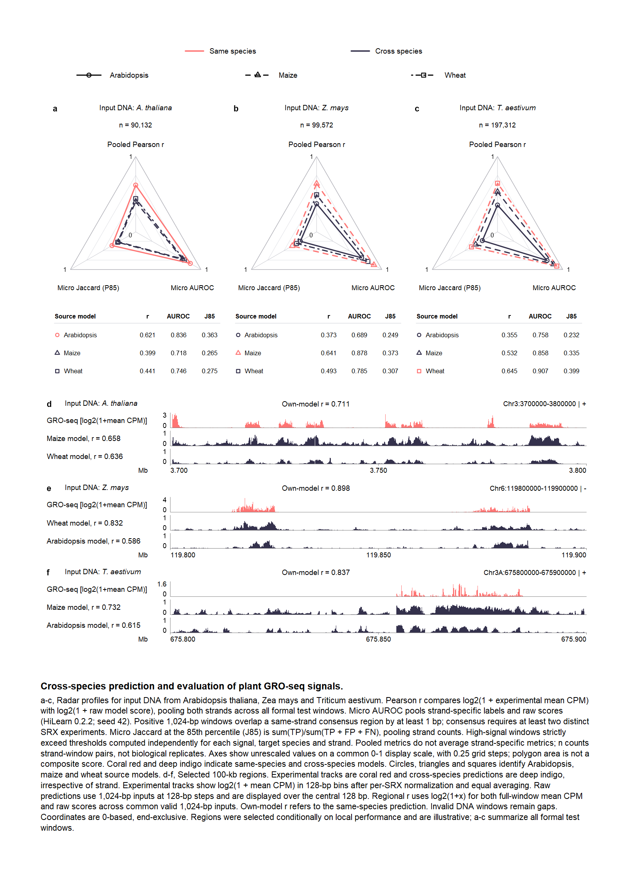
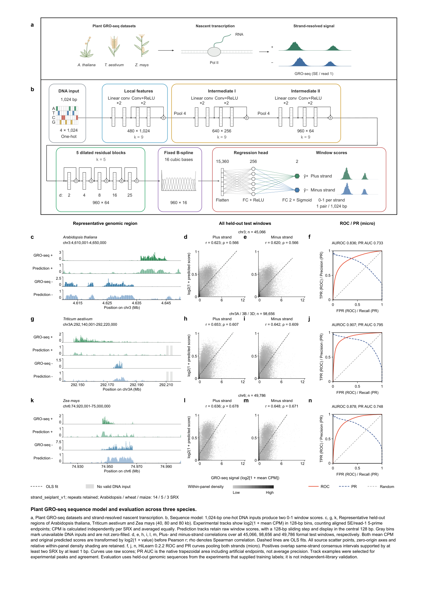
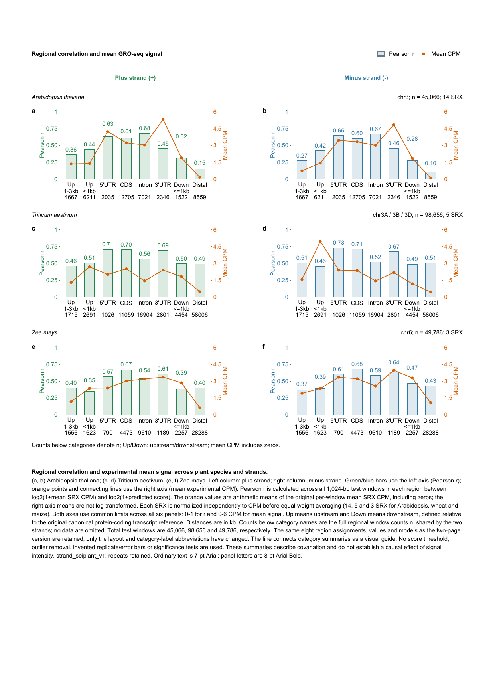
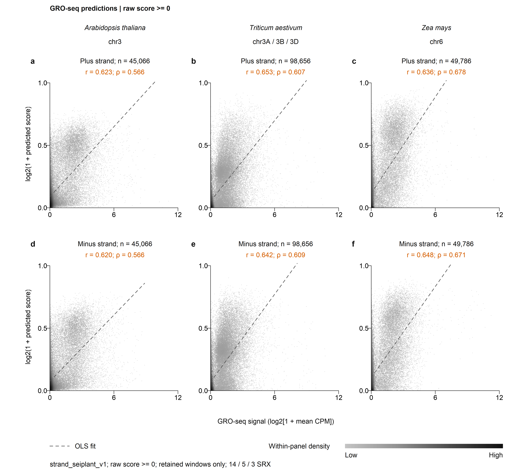
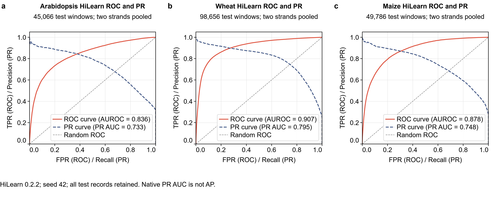

# Current figure previews

Each selected figure is shown in full below. Open its PDF to inspect fine text;
follow **Drawing scripts** to find the complete-figure and individual-panel
commands. The [script index](../plotting/README.md#selected-final-figures-script-index)
also maps every figure to its inputs and entry files.

These are the unchanged author-selected references. Regenerated files go to
the local `figure/results/` directory.

## Cross-species radar and genomic tracks

[Original A4 PDF with caption](radar_tracks/GROseq_radar_tracks_with_legend_A4.pdf) ·
[183 × 210 mm artwork PDF](radar_tracks/GROseq_radar_tracks_artwork_183x210mm.pdf) ·
[Drawing scripts](../plotting/radar_tracks/README.md) ·
[Plot data](../data/radar_tracks/README.md)

Panels a–c combine pooled Pearson r, micro AUROC and P85 micro Jaccard without
normalization. Panels d–f show the three selected 100-kb genomic examples.

## Workflow, model and evaluation composite

[Original A4 PDF with caption](combined_v2/GROseq_combined_v2_A4.pdf) ·
[Drawing scripts and panel mapping](../plotting/combined_v2/README.md) ·
[Plot data](../data/combined_v2/)

The complete figure includes the GRO-seq workflow (a), model architecture (b),
three genomic track groups (c, g, k), six strand-specific scatter panels
(d/e, h/i, l/m), and pooled-strand ROC/PR curves (f, j, n).
The a/b schematic is preserved vector artwork under the drawing module's
`assets/` directory; numeric panels can be redrawn from their supplied data.
The module exports all 14 panels separately.

## CPM deciles with grouped strands

[Original A4 PDF](deciles_final/reference/GROseq_CPM_deciles_grouped_strands_A4.pdf) ·
[Drawing scripts and panels a–c](../plotting/deciles_final/README.md) ·
[Plot data](../data/deciles/README.md)

The plus/minus strands remain separately ranked and calculated. Points and
95% intervals use the frozen statistics; the layout does not pool strands.

## Regional correlation and mean signal

[Original A4 PDF](region_signal_final/region_signal_six_panels_A4.pdf) ·
[Drawing scripts and panels a–f](../plotting/region_signal_final/README.md) ·
[Summary data](../data/region_signal_final/) ·
[Full window data](../data/regional/README.md)

Bars show region-specific Pearson correlations; the independent right axis
shows mean experimental CPM. Each species has separate plus/minus panels.

## Supporting evaluation previews

These use repeat-retained `strand_seiplant_v1`, with Arabidopsis / wheat / maize
= 14 / 5 / 3 SRX libraries.

### Complete-test correlations

[Drawing scripts](../plotting/correlations/) · [Data](../data/regional/README.md)

### HiLearn native ROC and PR curves

[Drawing scripts](../plotting/roc_pr/README.md) · [Data](../data/roc/)

Native PR AUC is not average precision (AP). The figure definitions and stored
exact metrics distinguish them.
